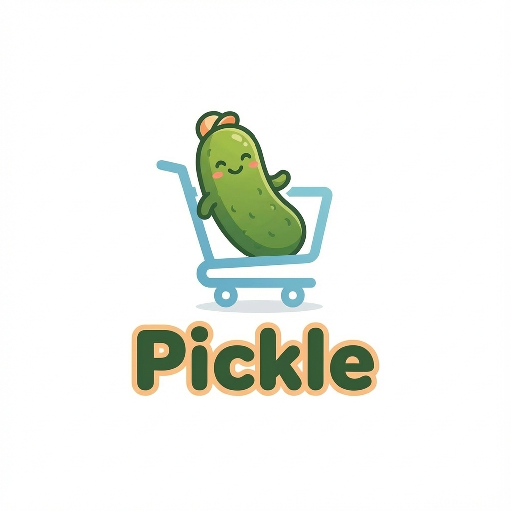
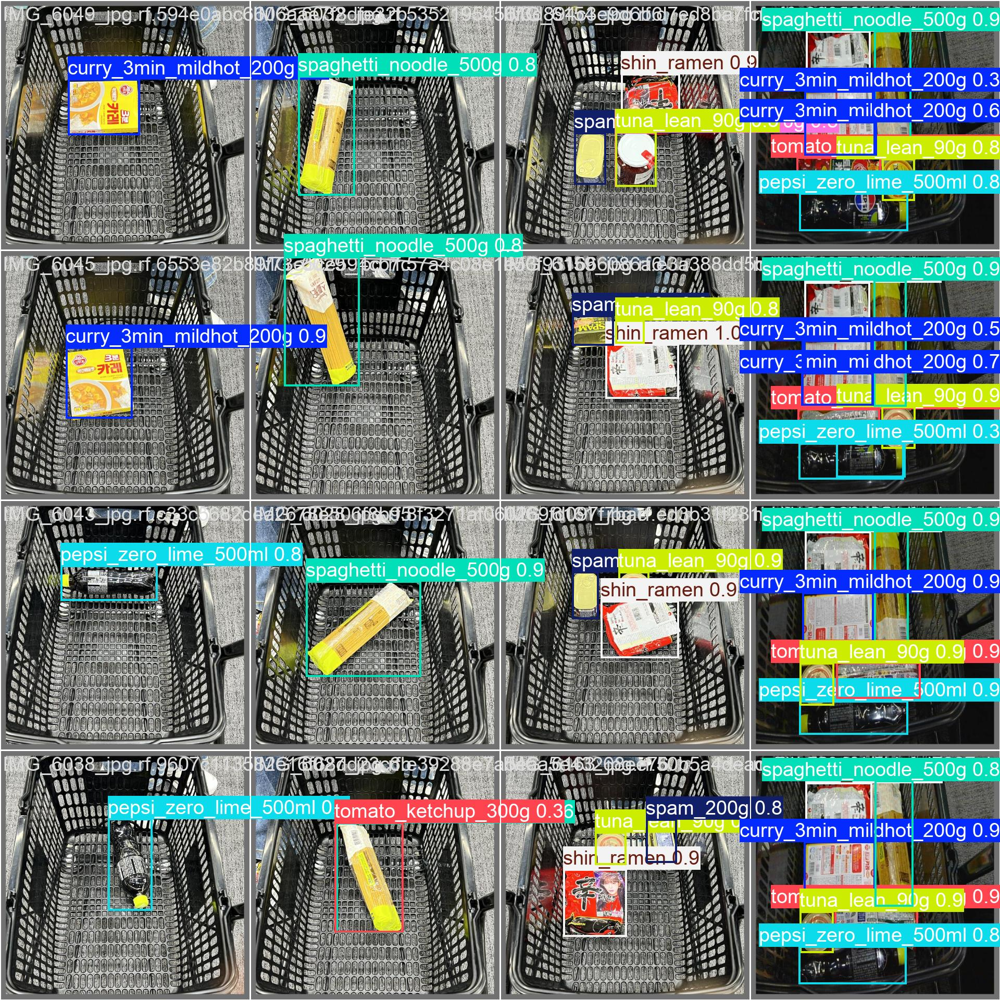
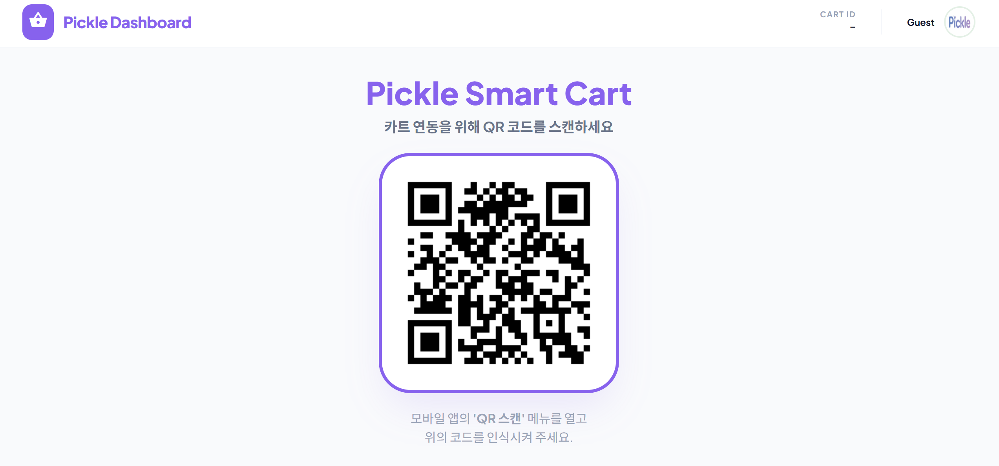
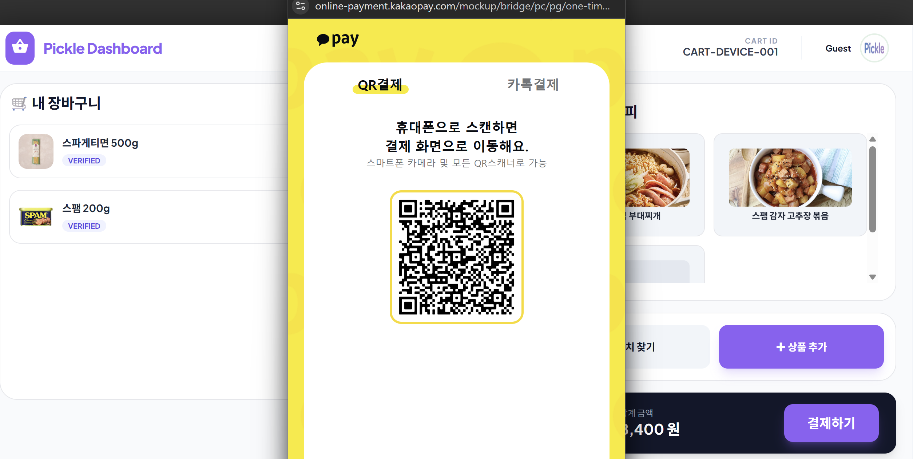
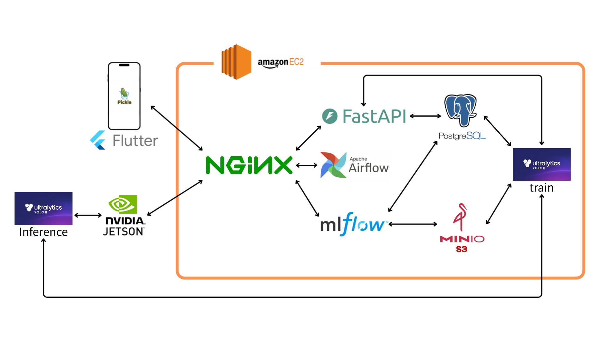
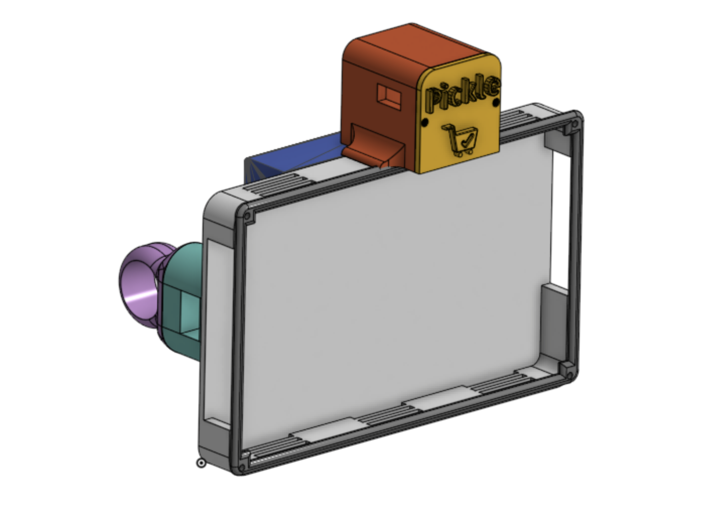
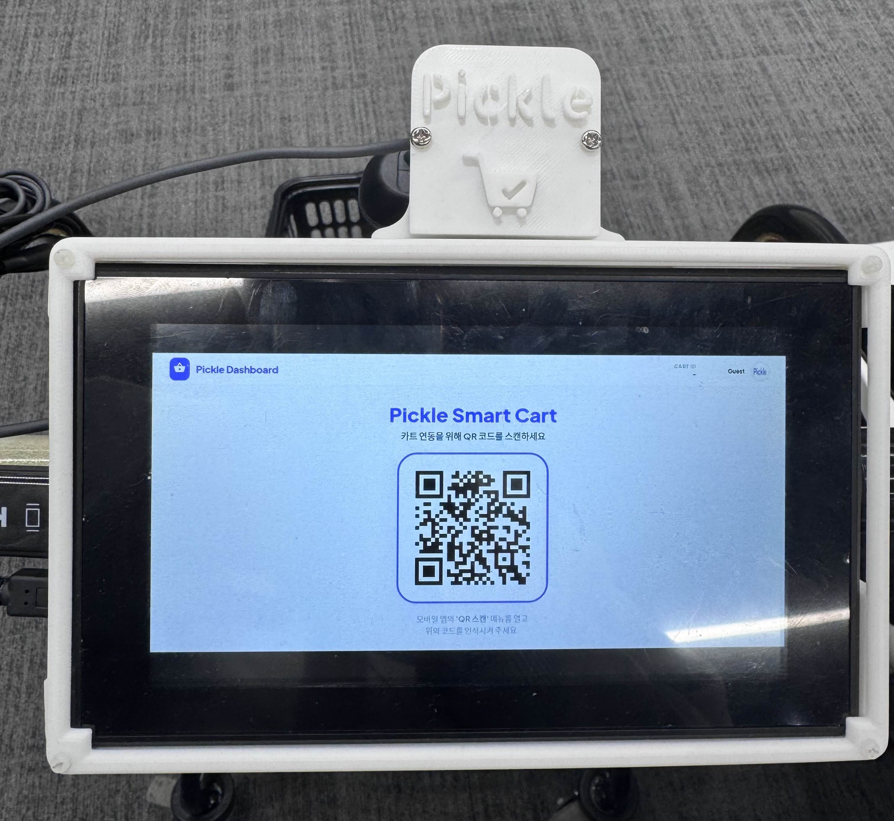
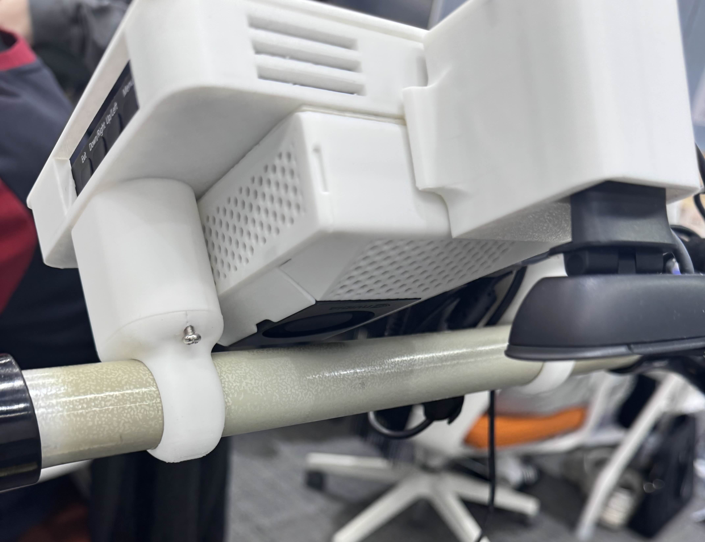

# 🥒 Pickle – AIoT 기반 스마트 쇼핑카트 서비스

  

> **Pickle은 AI 기반 상품 인식과 자동 결제를 결합한 스마트 쇼핑 서비스입니다.**  
> 카트 디스플레이(Edge) · 웹 키오스크(Web) · 모바일 앱(App)을 연동해  
> **상품 인식 → 자동 합산 → 간편 결제 → 가계부 기록 → 레시피 추천** 흐름을 제공합니다.

---

## 📌 프로젝트 개요

- 프로젝트명: Pickle  
- 유형: AIoT 스마트 쇼핑카트 서비스  
- 기간: 5주  
- 인원: 6명  

---

## ✨ 주요 기능

### 📱 App Logo

  

---

### 🤖 AI 상품 인식 (Edge)

- Jetson Orin Nano + 카메라 기반 객체 탐지 (YOLOv8)
- 인식 상품 실시간 리스트업
- 무게 센서 연동으로 정합성 보정

  

---

### 🖥 웹 키오스크 Front

- Vue 기반 웹 프론트엔드
- 실시간 카트 세션 모니터링
- AI 인식 상품 리스트 확인
- 자동 합산 금액 표시
- 관리자용 상품 / 카테고리 관리 UI

  

---

### 📺 카트 디스플레이 UX

- 실시간 상품 목록 / 합계 표시
- 계산하기 버튼 제공
- 모바일 · 웹과 세션 동기화

  

---

### 💳 자동 결제 (KakaoPay)

- QR 기반 카트–모바일 연결
- 카트에서 결제 요청
- 서버 승인 후 자동 결제

  

---

### 📱 Flutter 모바일 앱

- 로그인 / 회원가입
- 카드 등록
- QR 연동
- 가계부 / 분석
- 마이페이지

  

---

### 🔍 상품 검색 페이지

- 상품명 기반 검색
- 추천 레시피 연동
- 상세 정보 확인

  

---

### 📊 최근 지출 내역 / 가계부

- 최근 결제 리스트
- 캘린더 기반 월별 소비
- 카테고리 도넛 차트
- Top Items 분석

  

---

### 🍳 레시피 추천

- 구매 상품 기반 추천
- pgvector 임베딩 유사도 검색
- 재료 ↔ 음식 양방향 추천

  

---

## 🧭 전체 서비스 흐름

  

1. 모바일 로그인  
2. QR 스캔 → 카트 세션 연결  
3. 상품 담기 → Edge AI 인식  
4. 웹 키오스크 상품 리스트 / 합산 표시  
5. 카트 디스플레이 동기화  
6. 계산 요청  
7. KakaoPay 자동 결제  
8. 가계부 기록  
9. 레시피 추천  

---

## 🛠 시스템 아키텍처

  

---

## 🔩 하드웨어 구성

### 📐 3D 모델 설계 (Onshape)

- LCD 하우징
- Jetson Orin Nano 케이스
- 카메라 하우징
- 카트 클램프 구조
- 배선 고려 내부 구조

  

  

---

### 🛠 실물 제작 및 장착

- Bambu Lab 3D Printer 출력
- 기본 공차 0.3mm 적용
- 압입 공차 0.1mm
- 비틀림 압입(Twist Fit) 방식으로 손잡이 고정

  

  

  

---

## 🔧 기술 스택

### Mobile
- Flutter
- Riverpod
- GoRouter

### Web
- Vue 3
- JavaScript
- SCSS

### Backend
- FastAPI
- PostgreSQL
- pgvector
- SQLAlchemy
- Alembic

### AI / Edge
- Jetson Orin Nano
- YOLOv8
- OpenCV

### Infra
- Docker
- Nginx

---

## 👥 역할 분담

|  <h3>팀장 · 준서</h3><b>Hardware · Mobile</b> |  <h3>한결</h3><b>MLOps/DevOps · CI/CD</b> |  <h3>준수</h3><b>AI</b> |
|:--:|:--:|:--:|
|  <h3>수명</h3><b>Mobile · Backend</b> |  <h3>주연</h3><b>Backend · Web Front</b> |  <h3>정희</h3><b>Backend · AI</b> |

